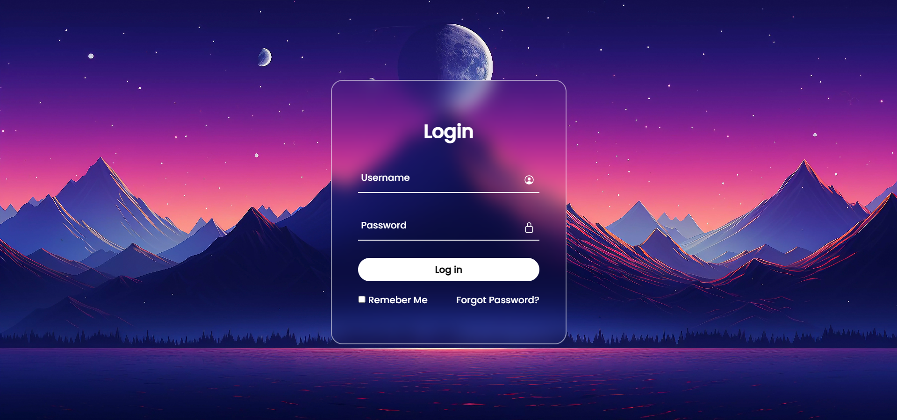

# Login Form

A clean, responsive login form built with HTML, CSS and a touch of JavaScript.

> Login Form Built Using HTML, CSS And Javascript.

## Preview

## Features

- Simple and modern login UI
- Responsive layout that works on desktop and mobile
- Lightweight: only HTML, CSS, and vanilla JavaScript
- Easily customizable styles and background image

## Files

- `index.html` — markup for the login page
- `style.css` — styling and layout
- `Screenshot 2024-08-09 200743.png` — project screenshot
- `digital-art-beautiful-mountains (2).jpg` — sample background image included in the repo

## Usage

1. Clone this repository:

   git clone https://github.com/BinaryVortex/Login-Form-104.git

2. Open `index.html` in your browser (double-click the file or use Live Server / any static server).

3. Interact with the form. The included JavaScript is intended for UI behavior only — there is no backend authentication in this demo.

## Customization

- Change colors or spacing in `style.css`.
- Replace the background image with your own by editing the image path in the CSS or HTML.
- Add form validation or connect the form to a backend endpoint for real authentication.

## Contribution

If you'd like to contribute improvements, feel free to open an issue or send a pull request. Suggestions:

- Add accessibility improvements (ARIA attributes, keyboard focus styles)
- Add real form validation and error handling
- Provide alternate themes or animations

## License

This project is provided as-is. Feel free to reuse and modify for personal or educational purposes. If you'd like a formal license, add one (for example `MIT`).

## Author

BinaryVortex
